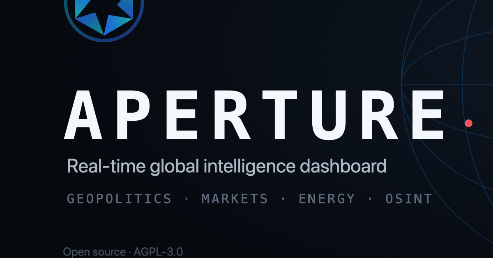

<div align="center">



# Aperture

**Real-time global situational awareness — geopolitics, markets, energy, and OSINT on one live globe.**

[](LICENSE)
[](https://vitejs.dev)
&nbsp;·&nbsp; [Local setup](LOCAL_SETUP.md) &nbsp;·&nbsp; [Changes](CHANGES.md) &nbsp;·&nbsp; [Attribution](NOTICE)

</div>

---

## What it is

Aperture is a single-pane intelligence dashboard: an interactive 2D/3D globe
surrounded by live panels for world events, conflict and instability signals,
markets, energy, macro indicators, natural hazards, and an AI analyst — one
situational-awareness view of the planet.

- **Dual map engine** — 3D globe + 2D flat map, light theme by default
- **Live data panels** — earthquakes, weather, news, prediction markets (no key),
  plus markets, macro (FRED), energy (EIA) and an AI analyst (with free keys)
- **Self-hostable** — runs entirely on your own infrastructure

## Quick start

**Frontend only** (fast; some data panels need the backend — see below):

```bash
npm install
npm run dev          # → http://localhost:3000
```

**Full stack with live data** (Docker + a few free API keys):

```bash
cp docker-compose.override.example.yml docker-compose.override.yml   # add keys
docker compose up -d         # → http://localhost:3000
./scripts/run-seeders.sh     # populate the data cache
```

Full instructions, the key→panel map, and the architecture diagram are in
**[LOCAL_SETUP.md](LOCAL_SETUP.md)** and **[SELF_HOSTING.md](SELF_HOSTING.md)**.

Point it at your own domain in one command:

```bash
./scripts/set-domain.sh your-domain.com
```

## License & attribution

Aperture is **free/open-source software under the [AGPL-3.0](LICENSE)**.

It is a derivative of **[World Monitor](https://github.com/koala73/worldmonitor)**
by Elie Habib (© 2024–2026), also AGPL-3.0. Per the license, the original
copyright and notices are preserved (see [NOTICE](NOTICE)), this fork remains
AGPL-3.0, and its complete source — including all modifications — is published
here. A summary of changes is in [CHANGES.md](CHANGES.md). The original project's
README is preserved as [UPSTREAM_README.md](UPSTREAM_README.md).

> Aperture is an independent rebrand for self-hosting and is not affiliated with
> or endorsed by the original authors.
